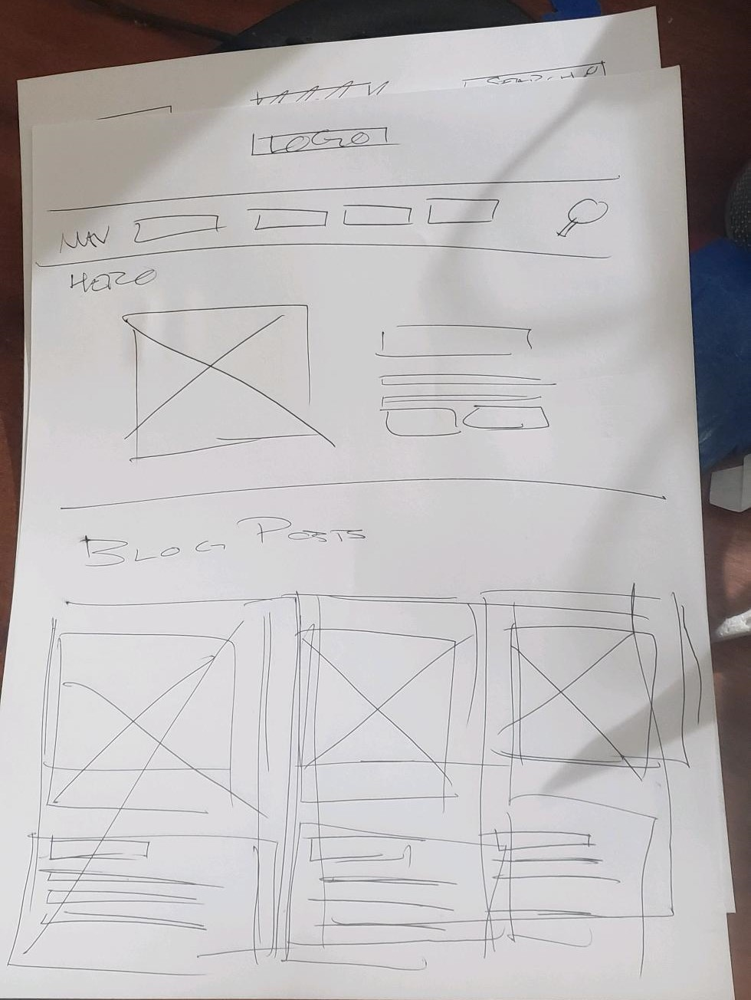
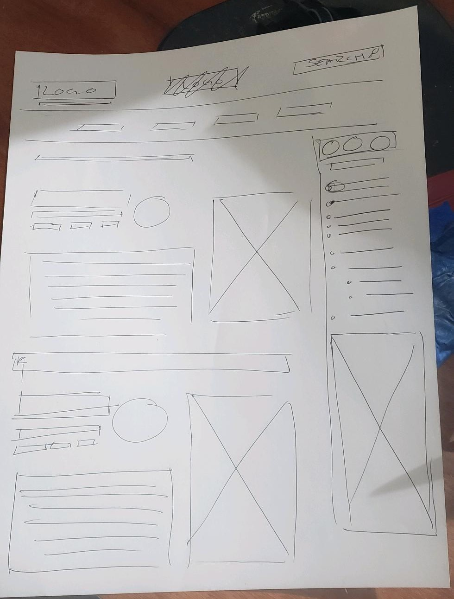

# Actividad Guiada - Propuesta de Blog

La empresa donde trabajas se ha enterado que tomaste el curso de Fundamentos de Diseño Web. Por ende, te han pedido que realices una propuesta para implementar un blog. Tu trabajo será realizar el wireframe para esta primera etapa con la estructura en general de la propuesta para el blog.

## Pasos a seguir

1. A mano (en una hoja de papel), realiza un wireframe con tu propuesta para el blog.
2. Al terminar, tómale una foto y adjúntala dentro de un documento de Word.
3. Entrega la propuesta a tu instructor.

## Consideraciones

- Se puede hacer el wireframe con un software (opcional), pero, de preferencia, realizarlo a mano.
- Intenta ser lo más descriptivo respecto a la estructura en general sin profundizar en su contenido.
- La solución propuesta es meramente un ejemplo, por tanto, por medio de tu creatividad, propón una solución diferente.

## Propuesta

 
